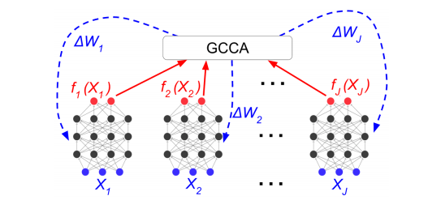

Introduction

Multiview Learning
Multi-view learning refers to the technique of performing machine learning on data that is represented by multiple distinct feature sets called views. Data from real world applications is multiple viewed because it is often collected from different measuring methods and it describes information more minutely than single viewed data. Information from different views can be effectively utilized to gain performance improvements.

CCA
CCA is a co-regularization style algorithm, which is one of the types of multiview learning methods. It is a subspace learning technique to find linear combinations(or projections) for 2 views (or vectors) such that the correlation between the two projections is maximized in the common subspace i.e for two input views CCA finds directions to maximize the correlation between them.
Two inherent drawbacks of traditional CCA are -
It can only be applied to datasets with only 2 views.
It can only calculate a linear correlation between the two views.
Since many real-world datasets can have more than one view and the relationship between the views can be nonlinear, traditional CCA has many extensions, two of which are discussed in the following sections.

DCCA
Deep Canonical Correlation Analysis (DCCA) is a non-linear two-view representation learning technique based on Deep Neural Networks (DNN). It is a parametric alternative of the Kernelized Canonical Correlation Analysis (KCCA). DCCA simultaneously computes representations of the two views by passing each of them through a DNN, such that the representations are maximally correlated. It does so by performing CCA on the outputs of the DNN. The objective of DCCA is to find parameters (weights and biases) for the 2 DNNs such that the correlation between their outputs is maximum.

GCCA
Generalized Canonical Correlation Analysis (GCCA) is an extension of CCA that can be applied to datasets with more than two views. It estimates pairwise correlations of multiple views. Its objective is to find a shared representation of different views.

DGCCA
Deep Generalized Canonical Correlation Analysis (DGCCA) is an extension of CCA that combines the advantages of DCCA & (MAXVAR) GCCA. It learns a shared representation from data with >2 views and simultaneously learns a DNN for each view in order to maximize the correlation between the learned representations.

At train time - DGCCA passes each view to a different DNN and then back propagates the gradient of the GCCA objective to update the DNN parameters. This trains the DNNs to reduce the GCCA reconstruction error among their outputs.
At test time -  New data is projected by feeding them through the learned DNN for each view.

DGCCA Algorithm -

