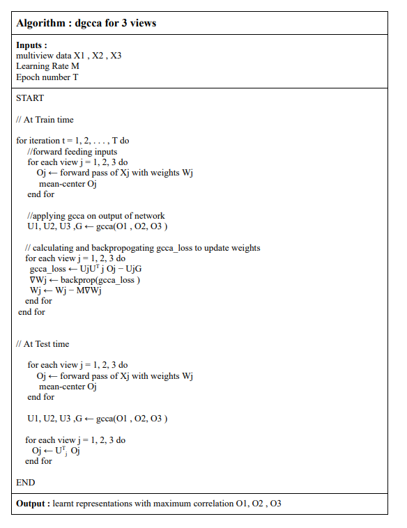

The DeepGeneralizedCCA package (https://github.com/shekhar-sharma/DataScience/tree/main/Groups/Group_ID_3/DeepGeneralizedCCA) implements Deep Generalized Canonical Correlation Analysis (DGCCA)

## DGCCA : Introduction
Deep Generalized Canonical Correlation Analysis (DGCCA) is an extension of CCA that combines the advantages of DCCA(Deep Canonical Correlation Analysis) & GCCA(Generalized Canonical Correlation Analysis). It learns a shared representation from data with >2 views and simultaneously learns a DNN for each view in order to maximize the correlation between the learned representations.

* **At train time** - DGCCA passes each view to a different DNN and then back propagates the gradient of the GCCA objective to update the DNN parameters. This trains the DNNs to reduce the GCCA reconstruction error among their outputs.
* **At test time** -  New data is projected by feeding them through the learned DNN for each view.

* **Constraint** : The nonlinear mappings from views to shared space must be differentiable.
* DGCCA does not reduce to DCCA for 2 views, since  the objective and constraints of the GCCA are different from that of the CCA problem.

* DGCCA Algorithm 

